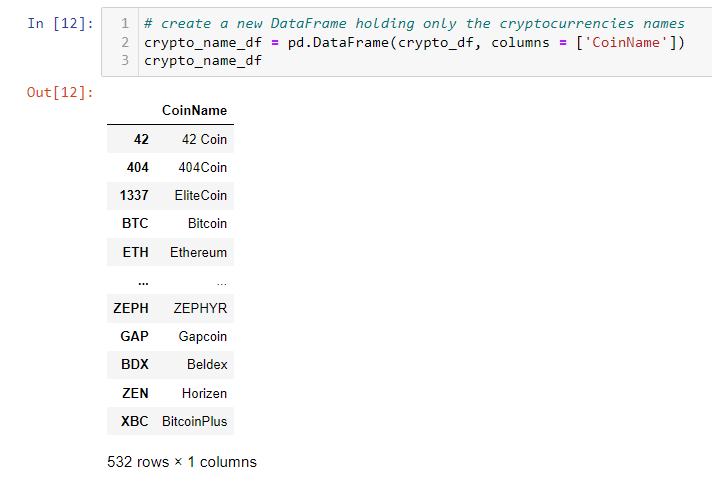
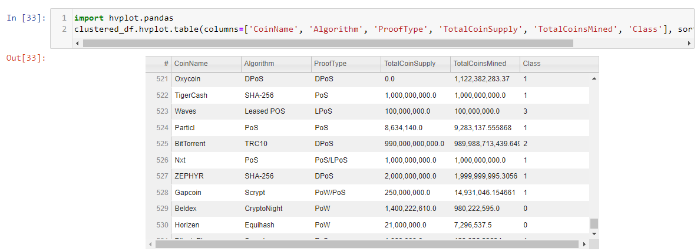
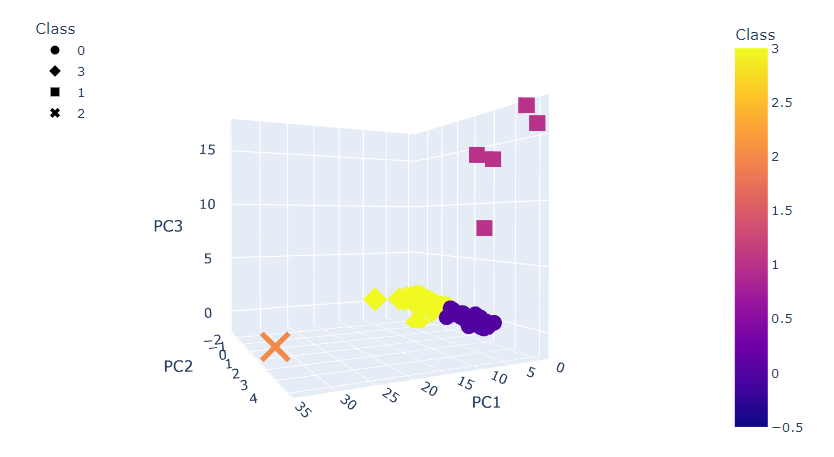
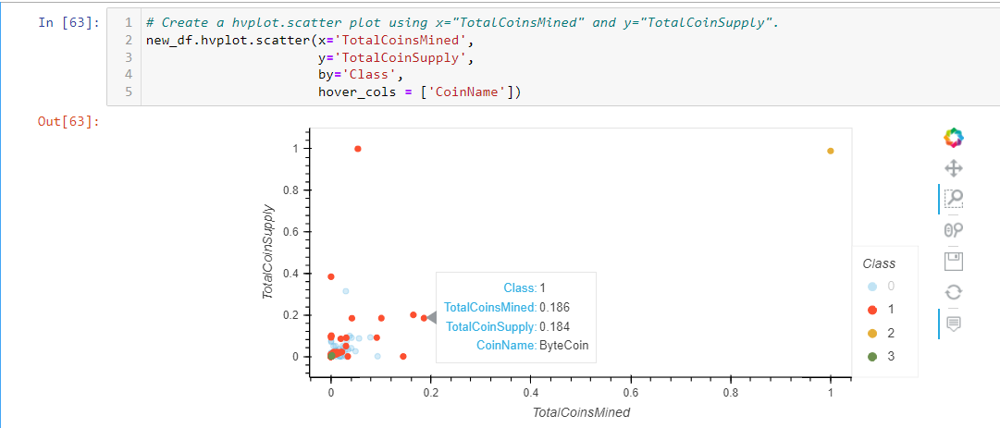

# Cryptocurrencies

## Background:
If was first necessary to research/learn how unsupervised learing 'worked' including:  
   - Learning what unsupervised learning is used for
   - how to process data for unsupervised learning
   - how to cluster
   - how to reduce your dimensions
   - how to reduce the principal components using PCA

This research file is 'Research Complete.ipynb'.

The analysis is created for our clients preparing to enter into the cryptocurrency market. 
They are interested in knowing which cryptocurrencies should be offered in investment 
portfolios for their customers. The report create includes:

Results: 

I did think about adding how I know the number of clusters are necessary. However, I am not adding the Elbow Curve. The client doesn't need to know the details of everything completed. They only need high-level details. (Remember, making a report so that your grandma can understand it, is very important.)

1) Listing all cryptocurrencies on the trading market.

(Note: Not all cryptocurrencies are being traded. We only interested in ones that are traded.)

2) Grouping to create a classification system for this new investment can be daunting. That is, 
You can answer the question by simply providing a table like this: 

However, some customers are visual learners. Here is a 3D-Representation of the classifications we will suggest creating.

And, even though our customers are visual learners, they may have a hard time with interpreting something 3D. So, I also present a 2D-scatter plot so the client has more than one way to look at the data. 

Summary: 
This may have seemed like small tasks; however, there are 532 unique cryptocurrencies. The client wanted us to organized them so they can be offered as a portfolio of cryptos.Learning about cryptocurrency is believed to be something that will prove to be benefitial for our client. If we can give clients comprehendable reports, our client will be able to begin initial business planning opportunities. 

